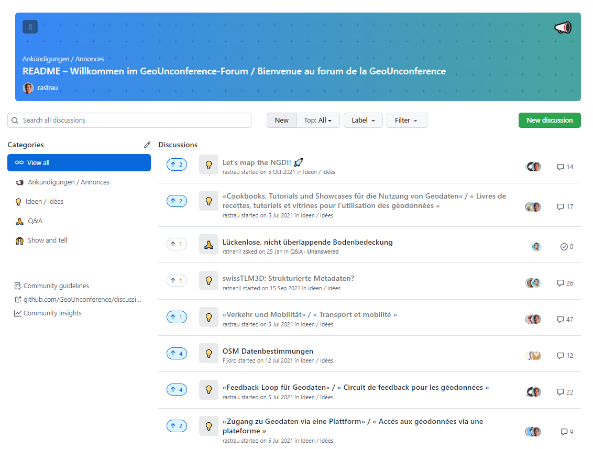
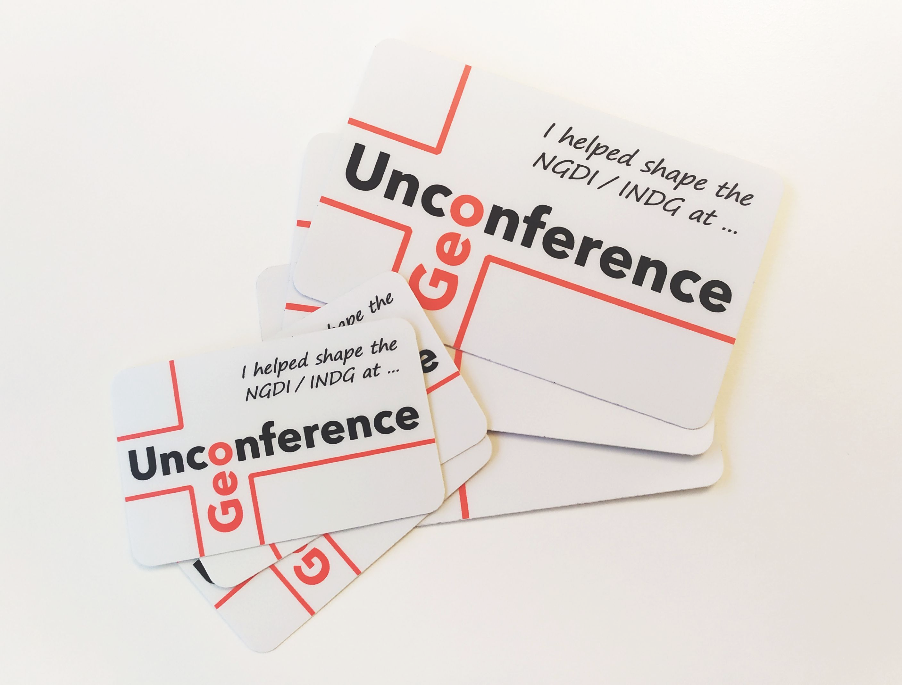

*[En français ci-dessous](#francais)*

# Die GeoUnconference

Die GeoUnconference-Veranstaltungsreihe stand unter Motto **Verbesserung von Zugang und Nutzung von Geodaten der Schweizer Behörden**. Insgesamt haben wir [vier GeoUnconferences ausgetragen](https://ti.to/geounconference):

- 24.06.2021 in Wabern
- 09.09.2021 in Olten
- 05.05.2022 in Neuchâtel
- 13.10.2022 in Bern

Organisiert wurde die GeoUnconference von **Ralph Straumann**, **Anne Wegmann** (bis 2021) und **Thomas Felder** von [EBP](https://www.ebp.ch), zusammen mit **David Oesch** von [swisstopo KOGIS](https://www.swisstopo.admin.ch/de/swisstopo/organisation/kogis.html) und **Stefan Ziegler**, [Leiter des Amts für Geoinformation und Kantonsgeometer des Kantons Solothurn](https://so.ch/verwaltung/bau-und-justizdepartement/amt-fuer-geoinformation/ueber-uns). Die GeoUnconference wurde finanziert aus den [Zweckgebundenen NGDI-Mitteln](https://www.geo.admin.ch/de/ueber-geo-admin/leistungsauftrag/zweckgebundene-ngdi-mittel.html).

Während und zwischen den Veranstaltungen hat die GeoUnconference-Community gegen 20 Themen zur Verbesserung der Zugänglichkeit und der Nutzbarkeit von amtlichen Schweizer Geodaten diskutiert und mögliche Lösungen aufgezeigt. [Die Resultate sind im GeoUnconference-Forum einsehbar](https://github.com/GeoUnconference/discussions/discussions). Auf die Resultate kann für die Formulierung von Projektanträgen zuhanden der [Zweckgebundenen NGDI-Mittel](https://www.geo.admin.ch/de/ueber-geo-admin/leistungsauftrag/zweckgebundene-ngdi-mittel.html) aufgebaut werden. Falls Du einen entsprechenden Antrag planst, informiere bitte darüber im entsprechenden Diskussionsthread im [Forum](https://github.com/GeoUnconference/discussions/discussions).

Das [GeoUnconference-Forum](https://github.com/GeoUnconference/discussions/discussions) ist weiterhin aktiv und kann durch jede und jeden für das Einbringen neuer Ideen und Fragestellungen rund um die NGDI, den Austausch, Diskussionen und die (Weiter)Entwicklung von GeoUnconference-Ideen genutzt werden. 

Wir verfügen noch über Sticker der GeoUnconference. Falls Du Sticker wünschst, schreibe bitte ein Mail mit Deinen Kontaktangaben an [unconference@ebp.ch](mailto:unconference@ebp.ch).

Aktuell sind keine weiteren Austragungen der GeoUnconference geplant. Wir informieren gegebenenfalls über Neuigkeiten zur GeoUnconference per [Newsletter](http://eepurl.com/ht_KRn) und auf [Twitter](https://www.twitter.com/geounconference). Bei Fragen kontaktiere bitte das GeoUnconference-Team unter <a href="mailto:unconference@ebp.ch">unconference@ebp.ch</a>.

Vielen Dank an alle, die engagiert daran mitgearbeitet haben, die NGDI zu verbessern!

*<a name="francais"/>En français:*

# La GeoUnconference

La série de manifestations GeoUnconference était placée sous la devise **Amélioration de l'accès et de l'utilisation des géodonnées des autorités suisses**. Au total, nous avons organisé [quatre GeoUnconferences](https://ti.to/geounconference) :

- 24.06.2021 à Wabern
- 09.09.2021 à Olten
- 05.05.2022 à Neuchâtel
- 13.10.2022 à Berne

La GeoUnconference a été organisée par **Ralph Straumann**, **Anne Wegmann** (jusqu'en 2021) et **Thomas Felder** d'[EBP](https://www.ebp.ch), en collaboration avec **David Oesch** de [swisstopo COSIG](https://www.swisstopo.admin.ch/fr/swisstopo/organisation/cosig.html) et **Stefan Ziegler**, [chef de l'office de géoinformation et géomètre cantonal du canton de Soleure](https://so.ch/verwaltung/bau-und-justizdepartement/amt-fuer-geoinformation/ueber-uns). La GeoUnconference a été financée par les [moyens dédiés à l'INDG](https://www.geo.admin.ch/fr/geo-admin-ch/mandat-de-prestations/moyens-dedies-indg.html).

Pendant et entre les rencontres, la communauté de la GeoUnconference a discuté d'une vingtaine de thèmes visant à améliorer l'accessibilité et l'utilisabilité des géodonnées officielles suisses et a présenté des solutions possibles. [Les résultats peuvent être consultés sur le forum de la GeoUnconference](https://github.com/GeoUnconference/discussions/discussions). Les résultats peuvent servir de base à la formulation de propositions de projets à l'attention des [moyens dédiés à l'INDG](https://www.geo.admin.ch/fr/geo-admin-ch/mandat-de-prestations/moyens-dedies-indg.html). Si tu prévois de faire une telle demande, merci d'en informer le fil de discussion correspondant dans le [forum](https://github.com/GeoUnconference/discussions/discussions).

Le [forum de la GeoUnconference](https://github.com/GeoUnconference/discussions/discussions) est toujours actif et peut être utilisé par chacun-e pour apporter de nouvelles idées et questions concernant l'INDG, pour échanger, discuter et (continuer à) développer des idées de la GeoUnconference. 

Nous disposons encore d'autocollants de la GeoUnconference. Si tu souhaites des autocollants, merci d'envoyer un mail avec tes coordonnées à [unconference@ebp.ch](mailto:unconference@ebp.ch).

Actuellement, aucune autre édition de la GeoUnconference n'est prévue. Le cas échéant, nous vous informerons des nouveautés concernant la GeoUnconference par [newsletter](http://eepurl.com/ht_KRn) et sur [Twitter](https://www.twitter.com/geounconference). Pour toute question, veuillez contacter l'équipe de la GeoUnconference à l'adresse [unconference@ebp.ch](mailto:unconference@ebp.ch).

Merci à toutes les personnes qui ont contribué à l'amélioration de l'INDG !
